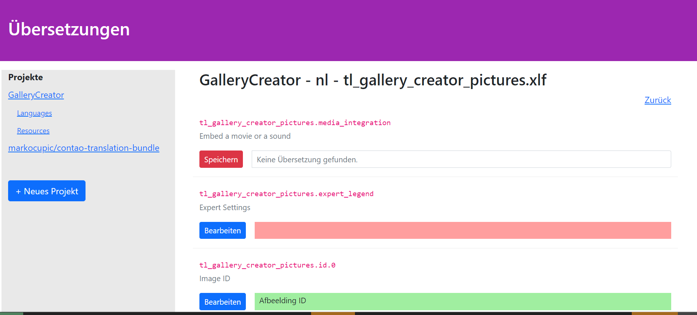

# "Mini Transifex" als Contao Frontend Modul (still under construction)

Dieses Bundle für das Contao CMS bietet
  für Programmierer mit kleinem Budget die Möglichkeit **Übersetzungsdateien im XLF Format**
  in einer Contao Installation zu pflegen. Dabei macht es Sinn diese Erweiterung in Kombination mit
  [markocupic/contao-php2xliff](https://github.com/markocupic/contao-php2xliff) zu verwenden.

## Installation mit composer oder **Contao Manager**
- Installtool
- Ins Backend wechseln.
- Neues Layout ohne Header und Footer einspaltig.
- Neues Frontend Modul vom Typ "Übersetzungs-APP" anlegen
- Neue, geschützte Seite anlegen und Modul einbinden.

## Empfehlungen beim Programmieren einer Extension
- Die Englischen Sprachdateien klassisch als PHP-Sprachdatei anlegen. Für die restlichen Sprachen PHP-Sprachdateien weglassen.
- Mit [markocupic/contao-php2xliff](https://github.com/markocupic/contao-php2xliff) von den PHP-Sprachdateien automatisch die XLF-Sprachdateien generieren lassen.
- Mit [markocupic/contao-translation-bundle](https://github.com/markocupic/contao-translation-bundle) die Sprachdateien aus dem vendor Verzeichnis einlesen.
- Danach die gewünschten Sprachen anlegen und alles übersetzen.
- Anschliessend die neu erstellten Sprachdateien zurück ins Vendor-Verzeichnis laden.
- Abschliessend mit `php composer/install` den Cache neu aufbauen.
- Im Verzeichnis `vendor/vendor-name/project-name/src/resources/contao/languages` sollten nun die neu erstellten XLF-Spachdateien sichtbar sein.

